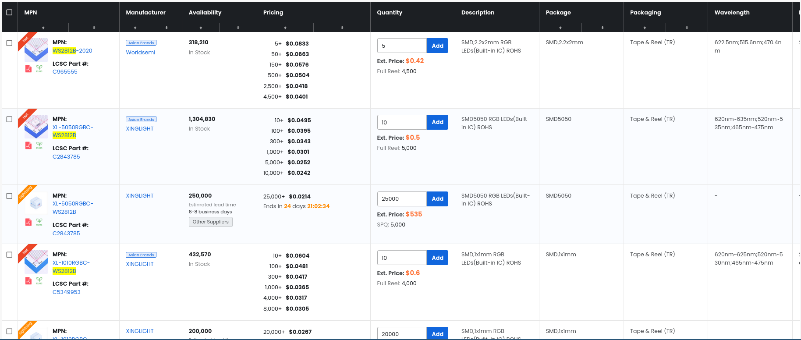
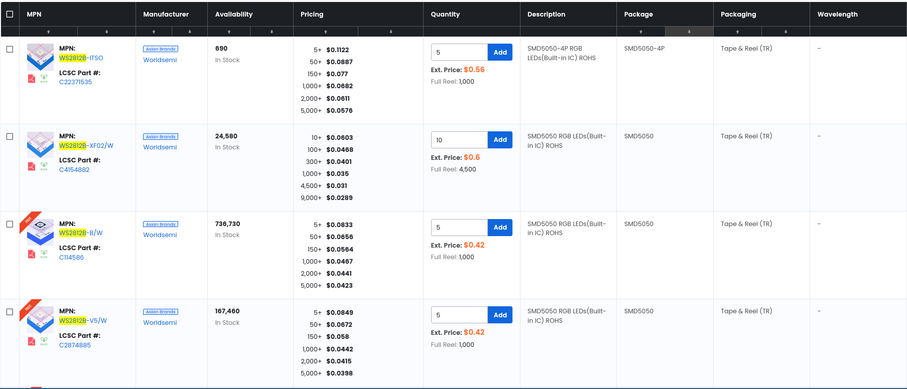

# Train Locs Board
## 04/05/2025
This is going to be a little LED train status board, This will show the Operating Company of a train whenever it gets into the station on the UK Midlands Mainline
### Design
I think my basic design guidelines, electronics wise are:
- ESP32 based board
- USB C
- As big of a RGB led as I can find

As far as design, I want to set a few constraints:
- Show every station
- Have an LED for every platform
- Use the National Rail Darwin Real Time API to get platform status
- Properly represent the physical layout of the network

### Physical Design
I think I want to go for a single board design, This is due to the reduced costs of only needing 1 set of boards and 1 stencil.
It also has a few other benefits, namely:
- Easier to design, as no need to allign the connectors
- Cleaner
- Less fastenings are required (makes it cheaper too)

However, It also has a few downsides:
- It makes it harder to design other track layouts
- If there is a big issue in the board, it means all the components are wasted, not just the display or the controller.

### Choosing Some Parts
Now we get to the fun part *wink*.

#### WS2812B
I started off by going looking for the biig neopixels, so I started looking on LCSC:

As you can see, there is a wide selection of sizes and other details, so I selected the descending filter and had a look:

As you can see, the [SMD5050-4P](https://www.lcsc.com/product-detail/RGB-LEDs-Built-in-IC_Worldsemi-WS2812B-ITSO_C22371535.html)  package is the largest, physically it's 5mm x 5mm. It is also relatively affordable at $0.1122 per unit (in orders of 5, I suspect it'll go down).

#### ESP32
Now to choose the heart of the operation, The ESP32.
My requirements for this were simple, it needed to do 2.4Ghz WiFI as my IOT network is 2.4Ghz only.
Otherwise, I generally like the S3 series of modules due to their onboard GPIO and enough:tm: flash (8MB).

I went for the [ESP32-S3-Wroom-1-N8](https://www.lcsc.com/product-detail/WiFi-Modules_Espressif-Systems-ESP32-S3-WROOM-1-N8_C2913198.html), due to it doing most of the work, and it being relatively affordable.

#### Other Misc Parts
USB C Connector:\
I chose the [G-Switch GT-USB-7010ASV](https://www.lcsc.com/product-detail/USB-Connectors_G-Switch-GT-USB-7010ASV_C2988369.html) due to it being widely liked, easy to solder and cheap. 

Voltage Regulator:\
I chose the [TP74333PDQNR](https://www.lcsc.com/product-detail/Voltage-Regulators-Linear-Low-Drop-Out-LDO-Regulators_TECH-PUBLIC-TP74333PDQNR_C2923398.html) due to it being very cheap, whilst outputting a lot of current (important for how hungry the ESP32 is).
The 5 part minimum is annoying though

Buttons:\
I chose the [TS-1089S](https://www.lcsc.com/product-detail/Tactile-Switches_XUNPU-TS-1089S-02526_C455282.html) buttons, because I think they look nice, but they are more expensive.

All other parts, I will just go with whatever is cheapest when it gets to the BOM.

### Designing the layout
I used this image of the Midlands Mainline as a source the for the stations and rough physical layout

I then went station by station, finding out the layout and number of platforms at each station:

| Station | Stanox Code | Count | Layout |
| ------- | ----------- | ----- | ------ |
| Sheffield | | 16 |
| Dronfield | | 2 |
| Chesterfield | 3 | |
| Alfreton | | 2 |
| Belper | | 2 |
| Derby | | 14 |
| Nottingham | | 17 |
| East Midlands Parkway | | |
| Loughborough | | |
| Leicester | | |
| Market Harborough | | |
| Kettering | | |
| Wellingborough | | |
| Bedford | | |
| Luton | | |
| St Albans City | | |
| London St Pancreas | | |
